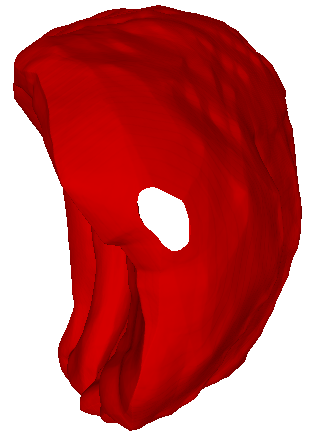
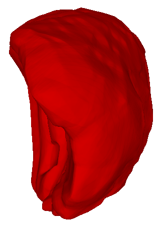

[README.md](https://github.com/user-attachments/files/19213372/README.md)# Dual-Pull : NURBS-Based Fitting of Dual Point Clouds for Fast Surface Reconstruction Using Thick-slice Scans

## A. Supplementary Material

Here, we provide supplementary material for the proposed NURBS fitting of dual point clouds and the pull-back operation to guide implicit neural representations of shapes. In Section A.1, we discuss the NURBS theory, the NURBS fitting process. In Section A.2, we discuss the dual point clouds pullback operation. In Section A.3, we provide more experimental results, including 3D reconstruction visualisation of different organs and different modal data. Finally, we provide a Ablation Study.

### A.1. NURBS  theory and the NURBS fitting process

#### A.1.1 NURBS  theory

NURBS (Non-Uniform Rational B-Splines) is a powerful method for representing curves and surfaces, widely used in computer graphics, CAD (Computer-Aided Design), and medical imaging reconstruction. Its features include:

- **Non-Uniform**: Allows precise control over local shapes.
- **Rational**: Uses weights to control the shape of the curve, enabling precise fitting.
- **B-Splines**: Ensures smooth connections and avoids abrupt changes.

# NURBS Curve Mathematical Expression

The mathematical expression of NURBS curves is as follows:

$$
C(u) = \frac{\sum_{i=0}^{n} N_{i,p}(u) w_i P_i}{\sum_{i=0}^{n} N_{i,p}(u) w_i}
$$

Where:

- $C(u)$ is a point on the curve;
- $P_i$ are the control points;
- $N_{i,p}(u)$ are the rational B-spline basis functions;
- $p$ is the degree of the curve;
- $u$ is the parameter that controls the shape of the curve.
  
#### A.1.2 the NURBS fitting process
Algorithm 1 is the organ contour processing procedure, while Algorithm 2 is the dual point cloud fitting process.
# Algorithm 1: NURBS Fitting for Initial Contours

## **Input**: 
- **P** = Extracted contour points from MRI slices

## **Output**: 
- NURBS-fitted contour curves

| **Step** | **Description** |
|----------|----------------|
| **1** | Sort contour points in a counterclockwise order using `sort_contour_point(P)`. |
| **2** | Initialize NURBS curve **N**: |
| **2.1** | Set degree **p = 3**. |
| **2.2** | Define control points. |
| **2.3** | Append the first **p + 1** control points to **P'** for closure. |
| **2.4** | Set the knot vector **T** as a uniform distribution. |
| **3** | Compute NURBS curve points **C** using NURBS interpolation. |
| **4** | Reconstruct 3D points: |
| **4.1** | For each point, assign **z** from the original contour layer. |
| **4.2** | Store the final 3D contour. |
| **5** | Return the fitted NURBS curve. |

# Algorithm 2: Dual Contour Construction

## **Input**: 
- **NURBS-fitted contours** from different MRI slices

## **Output**: 
- Dual contour curves for smooth 3D reconstruction

| **Step** | **Description** |
|----------|----------------|
| **1** | For each index **i** in \([1, m]\) (each corresponding contour point along the layers): |
| **1.1** | Extract corresponding points from all slices. |
| **2** | Construct a new NURBS curve **N_d**: |
| **2.1** | Set degree **p = 3**. |
| **2.2** | Define control points. |
| **2.3** | Generate a non-uniform knot vector. |
| **3** | Compute the dual contour curve. |
| **4** | Store the result in the dual contour set. |
| **5** | Return the dual contour curves. |

   ## A.2.pullback operation
   The figure 1 represents the pull-back process of the dual point cloud to the initial point cloud.
### **Figure 1: pullback operation**   

### A.3. Additional experiments and detail

#### A.3.1 Evaluation metrics

#### A.3.2 Experimental setup and timing performance

#### A.3.3 Quantitative Evaluation on ACDC Dataset(MRI)

To further validate the effectiveness and accuracy of the proposed **Dual-Pull** framework in 3D reconstruction of cardiac anatomy, we conducted experiments on the public **ACDC dataset**, focusing on three key anatomical structures: **left ventricle (LV)**, **right ventricle (RV)**, and **myocardium (Myo)**. We performed a comprehensive quantitative comparison with existing state-of-the-art methods, including **IGR**, **DiGS**, **PINC**, **IPSR**, and **SPSR**.

**Table 1** presents the evaluation results in terms of four metrics: **Chamfer Distance (CD)**, **Hausdorff Distance (HD)**, **Average Symmetric Surface Distance (ASSD)**, and **Earth Mover’s Distance (EMD)**.

From the overall results, the **Dual-Pull** method consistently achieves excellent performance on **CD** and **ASSD**, particularly in the reconstruction of the **RV** and **LV**, where CD scores are **2.58e-03** and _1.86e-02_, respectively. These values are significantly better than traditional methods, indicating superior reconstruction of overall geometry. Moreover, in terms of **ASSD**, Dual-Pull also achieves optimal or sub-optimal results for the RV and Myo, showcasing strong capabilities in boundary smoothness and spatial consistency.

Regarding the **Hausdorff Distance**, Dual-Pull outperforms all other methods on **LV** and **RV** with minimum HD values of **2.48e-01** and **1.47e-01**, respectively, demonstrating robust handling of outlier point errors. Although **IPSR** performs slightly better on HD in the **Myo** reconstruction, Dual-Pull remains competitive and stable.

For the **EMD** metric, differences among all methods are minimal (within the 1e-4 range), suggesting convergence in terms of point cloud density distribution. Thus, EMD more so reflects the uniformity of sampling strategies than the reconstruction quality itself.

From the organ-wise analysis, **Dual-Pull** excels particularly in structures with regular morphology and smooth surfaces (e.g., LV and RV), which can be attributed to its **NURBS-based contour-dual point cloud construction**. This strategy enhances geometric continuity across slices and significantly improves anatomical shape recovery.

However, for more structurally complex regions such as the **myocardium**, while Dual-Pull remains competitive in CD and ASSD, its HD value suggests room for improvement. Given the intricate surface details and irregular boundaries of the myocardium, future work may explore more expressive generative models—such as **Diffusion Models**—as alternatives to NURBS fitting, aiming to further boost reconstruction precision for complex anatomical structures.

---

#### Table 1. Quantitative Comparison on the ACDC Dataset (Lower is Better ↓)

| Organ | Method         | CD ↓       | HD ↓       | ASSD ↓    | EMD ↓      |
|-------|----------------|------------|------------|-----------|------------|
| **LV** | Dual-Pull (Ours) | _1.86e-02_ | **2.48e-01** | 8.62e-02  | **5.89e-04** |
|       | IGR            | 1.09e-02   | 5.75e-01   | _5.84e-02_ | **5.89e-04** |
|       | DiGS           | **4.92e-03** | 5.65e-01   | **3.44e-02** | **5.89e-04** |
|       | PINC           | 2.24e-02   | 5.89e-01   | 9.04e-02  | **5.89e-04** |
|       | IPSR           | 1.23e-02   | _5.49e-01_ | 4.62e-02  | **5.89e-04** |
|       | SPSR           | 5.52e-02   | _5.49e-01_ | 1.40e-01  | **5.89e-04** |

| Organ | Method         | CD ↓       | HD ↓       | ASSD ↓    | EMD ↓      |
|-------|----------------|------------|------------|-----------|------------|
| **RV** | Dual-Pull (Ours) | **2.58e-03** | **1.47e-01** | _2.80e-02_ | **5.48e-04** |
|       | IGR            | 6.19e-03   | 4.02e-01   | 4.03e-02  | **5.48e-04** |
|       | DiGS           | _2.92e-03_ | _2.74e-01_ | **2.77e-02** | **5.48e-04** |
|       | PINC           | 6.26e-02   | 5.22e-01   | 1.55e-01  | **5.48e-04** |
|       | IPSR           | 8.20e-03   | 3.74e-01   | 3.83e-02  | **5.48e-04** |
|       | SPSR           | 1.97e-02   | 3.74e-01   | 7.56e-02  | **5.48e-04** |

| Organ | Method         | CD ↓       | HD ↓       | ASSD ↓    | EMD ↓      |
|-------|----------------|------------|------------|-----------|------------|
| **Myo** | Dual-Pull (Ours) | _1.55e-02_ | 4.95e-01   | _7.69e-02_ | **2.89e-04** |
|       | IGR            | 3.42e-02   | _2.70e-01_ | 1.17e-01  | **2.89e-04** |
|       | DiGS           | **3.31e-03** | 4.77e-01   | **3.12e-02** | **2.89e-04** |
|       | PINC           | 3.71e-02   | 5.75e-01   | 1.11e-01  | **2.89e-04** |
|       | IPSR           | _4.25e-03_ | **2.10e-01** | 3.53e-02  | **2.89e-04** |
|       | SPSR           | 4.32e-02   | **2.10e-01** | 1.27e-01  | **2.89e-04** |

### **Figure 2: ACDC Dataset Surface Reconstruction**

### **Figure 3: 3D-Slicer compare with ours on ACDC Dataset**

#### A.3.3 Surface reconstruction on CHAOS(CT)
The proposed **Dual-Pull** 3D reconstruction framework was originally designed for **thick-slice MRI data**. However, thanks to its **generalized implicit field representation** and **robust geometric constraint mechanisms**, the method also demonstrates strong **cross-modality generalization capability** when applied to **CT slice data**. Experimental results show that even when the input modality shifts from MRI to CT, the Dual-Pull model consistently achieves **accurate reconstruction of organ surfaces**, effectively addressing challenges such as **sparsity** and **topological defects** caused by large inter-slice spacing. These findings further validate the **versatility and generalizability** of the proposed method in the field of medical imaging.
### **Figure 4:  ours on CT Dataset**

## 🔍 Ablation Study

To validate the contribution of each proposed component in improving 3D reconstruction performance, we conduct a detailed ablation study on the **right ventricle** masks of the **ACDC dataset**. The study evaluates the effectiveness of each core module in our proposed **Dual-Pull** framework, including:

- Dual-contour point cloud generation  
- Pull-back loss  
- Hessian smoothness regularization  
- Minimal surface (area) loss  

The baseline is set to **IGR**, and the modules are incrementally added to analyze performance improvements. Results are summarized in the table below.

### Key Observations:

1. **📌 Dual-contour point cloud module (Base model) shows significant gains:**  
Compared to the IGR baseline, adding the dual-contour point cloud module (Base) reduces Chamfer Distance (CD), Hausdorff Distance (HD), and Average Symmetric Surface Distance (ASSD) by **42.49%**, **35.95%**, and **23.26%** respectively. This shows the module effectively reduces reconstruction errors caused by sparse slice intervals and enhances continuity across anatomical layers.

2. **🔧 Individual loss functions contribute differently:**  
Adding **Pull-back**, **Hessian**, and **Area** losses on top of the base model each improve different aspects:
   - **Pull-back loss** leads to the most substantial improvements, with HD reduced by **51.94%**.
   - **Hessian regularization** improves local surface smoothness, reflected in ASSD (↑23.56%).
   - **Minimal area loss** improves global consistency, with HD improved by **41.51%**.

3. **🔗 Combined loss functions exhibit synergy:**  
When two losses are combined:
   - **Area + Hessian** performs best overall, achieving the highest improvement across all three metrics (CD: ↑59.54%, HD: ↑64.66%, ASSD: ↑30.27%).
   - **Pull + Area** ranks second with comparable gains, indicating synergistic effects across loss types.

### 📊 Quantitative Results

| Method                            | Chamfer Distance ↓ | Hausdorff Distance ↓ | ASSD ↓         |
|----------------------------------|---------------------|-----------------------|----------------|
| **IGR (Baseline)**               | 0.006187 (0.00%)    | 0.401772 (0.00%)      | 0.040283 (0.00%) |
| + Dual cloud points (Base)            | 0.003558 (**↑42.49%**) | 0.257340 (**↑35.95%**) | 0.030915 (**↑23.26%**) |
| + Base + Pull-back               | 0.002773 (**↑55.18%**) | 0.193097 (**↑51.94%**) | 0.028979 (**↑28.06%**) |
| + Base + Hessian                 | 0.003198 (**↑48.31%**) | 0.257882 (**↑35.81%**) | 0.030793 (**↑23.56%**) |
| + Base + Area                    | 0.003516 (**↑43.17%**) | 0.235006 (**↑41.51%**) | 0.031351 (**↑22.17%**) |
| + Base + Area + Hessian          | 0.002503 (**↑59.54%**) | 0.142005 (**↑64.66%**) | 0.028089 (**↑30.27%**) |
| + Base + Pull-back + Hessian     | 0.003317 (**↑46.39%**) | 0.272452 (**↑32.19%**) | 0.029886 (**↑25.81%**) |
| + Base + Pull-back + Area        | 0.002578 (**↑58.33%**) | 0.146873 (**↑63.44%**) | 0.027947 (**↑30.62%**) |

> 📌 All metrics are "the lower the better". Improvement percentages are relative to IGR.

---

### 🖼 Visual Comparison

The figure below shows visual reconstruction comparisons of the **right ventricle** on the ACDC dataset. It is evident that the **minimal surface loss** provides more natural extrapolation in regions with missing slices.

  
  

**Figure:** Visual comparison of right ventricle 3D reconstruction on ACDC dataset  
Left: *Ours without Area loss* Right: *Ours with Area loss*

